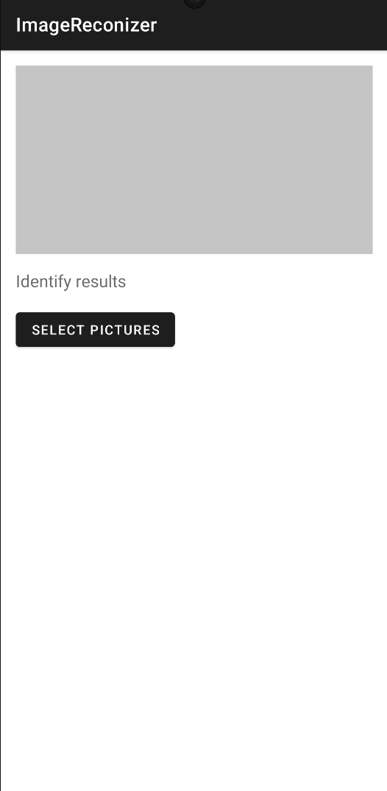
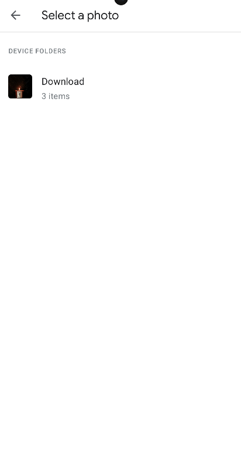
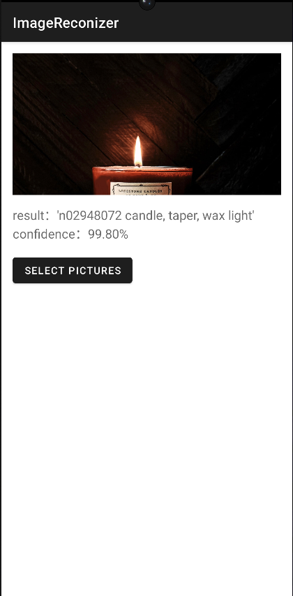

# 📱 Image Recognizer App (Kotlin + OpenCV + MobileNet)

This Android app allows users to classify images using the MobileNet model through OpenCV's DNN module. The user selects an image from the gallery, and the app runs the model to predict and display the most likely class label along with a confidence score.

---

## 🚀 Features

- Select an image from the device gallery
- Run image classification using MobileNet (Caffe format)
- Display the top predicted label with confidence
- Handles image preprocessing (resizing, normalization, RGB/BGR conversion)
- Uses OpenCV's lightweight DNN module—no external inference engine needed

---

## 🧠 Tech Stack

| Component              | Role                                 |
|------------------------|--------------------------------------|
| Kotlin                 | Android app logic                    |
| OpenCV for Android     | Image preprocessing and model inference |
| MobileNet (Caffe)      | Image classification model           |
| Android SDK 21+        | Minimum supported API level          |

---

## 🧪 Model & Preprocessing

- Model: MobileNet V1 trained on ImageNet (Caffe format)
- Input: 224×224 RGB image
- Preprocessing steps:
    - Resize to 224×224
    - Convert RGBA → RGB
    - Normalize pixel values to [0, 1]
    - Swap R and B channels (RGB → BGR for OpenCV)
- Output: Softmax vector of 1000 class probabilities

---

## Operation Effect

